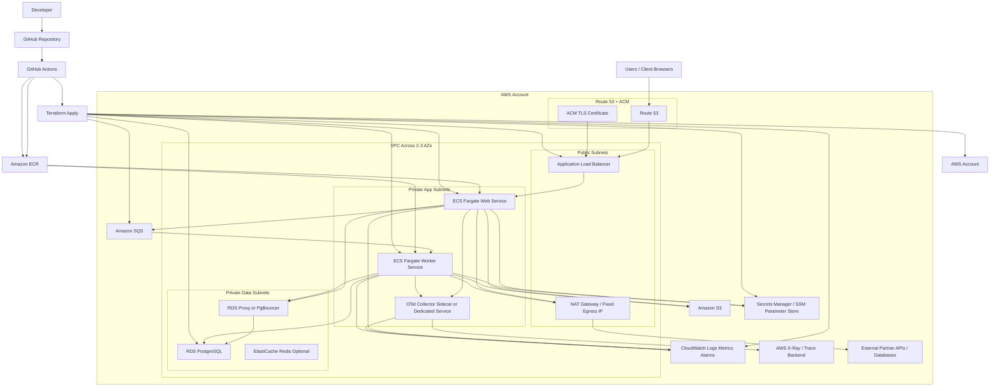

# Architecture Proposal

## Summary

Proposed target platform:

- Application runtime: AWS ECS on Fargate
- Infrastructure as code: Terraform
- CI/CD: GitHub Actions
- Database: Amazon RDS for PostgreSQL
- Object storage: Amazon S3
- Async spike handling: Amazon SQS with separate worker service
- Observability: CloudWatch, OpenTelemetry, and alerts

This keeps the application as a modular monolith for the web tier while separating expensive background work into independently scalable workers. That is the key design choice for handling memory spikes and high database write load without taking on Kubernetes complexity too early.

## Why ECS Instead Of Kubernetes

ECS on Fargate is the preferred choice because:

- The current repos are mostly single deployable applications with React plus backend code in one repo.
- The team is small and early-stage, so reducing operational overhead matters more than maximizing platform flexibility.
- ECS integrates directly with ALB, ECR, CloudWatch, IAM, CodeDeploy, and autoscaling.
- Fargate removes EC2 node management, which is useful for a first DevOps hire building a production baseline quickly.
- The main scaling problem is not service orchestration. It is isolating heavy background jobs from user-facing traffic.

Kubernetes would only become the better choice if the company later needs strong multi-team platform abstractions, many independently operated services, complex scheduling, or portability requirements that justify the extra complexity.

## High-Level Architecture

## Design Notes

### Request Path

- Users reach the application through Route 53 and an ALB with TLS from ACM.
- The ALB forwards traffic to the ECS web service running in private subnets.
- The web service reads and writes through RDS Proxy or PgBouncer before reaching PostgreSQL.

### Spike Handling

- Expensive tasks are removed from the synchronous request path.
- The web service places jobs onto SQS.
- A separate ECS worker service consumes those jobs.
- Worker autoscaling is driven by queue depth, CPU, and memory.
- This prevents heavy tasks from exhausting memory in the web tier or causing visible slowdowns for users.

### Outbound Fixed IP

- Both web and worker tasks run in private subnets.
- Outbound traffic goes through a NAT Gateway with Elastic IP.
- Partners can whitelist that static public IP for API and database access.

### Observability

- Application logs go to CloudWatch Logs.
- ECS and ALB metrics go to CloudWatch metrics and alarms.
- OpenTelemetry captures traces and service metrics.
- Alerts are configured for latency, 5xx errors, queue backlog, task restarts, CPU, memory, and database pressure.
- Business-facing metrics should also be captured, such as job volume by client, queue age, processing time, throughput, and failure rate.

### Operational Targets

- API availability target: 99.9 percent or better for the customer-facing web tier.
- API latency target: keep interactive request latency within an agreed p95 threshold.
- Queue-processing target: background backlog should drain within a defined time window after a client spike.
- Deployment target: zero-downtime web deploys with rollback on failed health checks.
- These would be tuned with real usage data, but they make the observability and operational-readiness plan more concrete.

### CI/CD

- GitHub Actions runs tests, builds container images, pushes to ECR, and deploys infrastructure and application changes.
- Terraform manages the platform resources.
- Application deploys use ECS rolling or blue/green deployment patterns.

## Terraform Scope

Terraform should manage:

- VPC, subnets, route tables, NAT, and security groups
- ALB, listeners, and target groups
- ECS cluster, task definitions, services, and autoscaling
- ECR repositories
- SQS queues and dead-letter queues
- RDS PostgreSQL, subnet groups, and parameter groups
- Secrets Manager or SSM parameters
- CloudWatch dashboards, log groups, and alarms
- IAM roles and policies

## Suggested GitHub Actions Flow

1. Pull request:
   - install dependencies
   - run type checks and tests
   - build app and container image
   - run `terraform fmt -check` and `terraform validate`
2. Merge to main:
   - build and push image to ECR
   - run Terraform plan and apply for the target environment
   - deploy updated ECS service
   - run database migrations in a controlled deploy step
